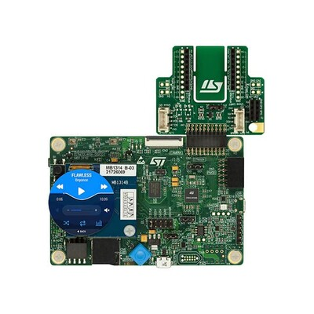

# Projet_IA_Embarque

 
<b>STM32L4R9I-DISCO-Kit</b>

## Contexte

La **maintenance prédictive** permet, grâce à l'entrainement d'un réseau de neurones sur des données de fonctionnement d'une machine, de prédire les pannes à venir et d'anticiper les réparations. Il est alors possible d'optimiser la production en fonction des pannes à venir et de limiter la quantité de temps et d'argent dépensés dans la maintenance curative.

Ce projet à pour but de montrer la démarche suivie pour :
- Entrainer un réseau de neurones sur un dataset standard de maintenance prédictive (AI4I-2020)
- Evaluer ses performances en inférence
- Implémenter le réseau sur une cible embarquée (STM32L4R9) via l'outil d'IA embarquée de STMicroelectronics X-Cube-IA
- Evaluer les performances du réseau embarqué (potentiellement différentes à cause de la compression du modèle pour tenir dans la mémoire contrainte de la cible)

## Utilisation

Pour tester le modèle sur la cible embarquée, il faut brancher en usb via le ST-Link la cible sur l'ordinateur. En exécutant le programme Python *communication.py* et en précisant le bon port usb (voir *Gestionnaire de périphériques*) il est alors possible de tester le modèle.

## Conception du réseau de neurones
### Entrées / Sorties du modèle

Etant donné les grandeurs fournies dans la base de données *AI4I-2020*, nous avons choisi les entrées et sorties suivantes pour notre modèle:

Inputs du modèle:
- Air temp
- Process temp
- Rotational speed
- Torque
- Tool wear
- **Power** (Torque*Rotational speed) (donnée composite ajoutée pour améliorer les prédictions)

Outputs du modèle:
- TWF
- HDF
- PWF
- OSF
- **NF** (No failure) (Sortie déduite de l'abscence de panne)

Informations retirées des outpus:

* NRF: car on a trop peu de données pour pouvoir entrainer le modèle à prédire ce type de panne.
* NSF (No Specific Failure): On a pas d'information claire sur comment détecter ce type de panne. De plus on nous demande de détecter et classifier.

### Architecture du modèle
Pour l'entrainement sur la base de données *AI4I-2020* nous avons choisi l'architecture de réseau de neurones suivante:

|N° couche dense|Largeur (nb neurones)|Fonction d'activation|Dropout|
|-|-|-|-|
|1|64|relu|0.5
|2|32|relu|0.5
|3|16|relu|0
|4|5|softmax|0

### Justification des couches du modèle
- Les fonction d'activation relu permettent de limiter l'effet de vanishing gradient
- L'utilisation de dropout permet de limiter l'effet d'overfitting en désactivant aléatoirement 50% des neurones de la couche concernée à chaque itération d'apprentissage
- Softmax est courrament utilisée pour s'assurer d'avoir des probabilités utilisables en sortie du réseau (somme = 1).
- Etant donné que nous avons 5 classes, la couche de sortie comporte 5 neurones

Les choix réalisés permettent de capturer correctement les relations entre les données tout en évitant le sur apprentissage.

## Entrainement du modèle

La mise au point d'un modèle d'IA embarquée se découpe en deux grandes phases que sont:
- L'entrainement
- L'inférence

La phase la plus demandante en termes de ressources est l'entrainement, c'est pour cela qu'elle est réalisée sur un ordinateur (ou en exécution à distance sur un TPU via Google Collab).\
Pour réaliser cette phase, nous avons utilisé le fichier Jupyter Notebook *TP_IA_EMBARQUEE.ipynb* présent dans ce répertoire GitHub. La base de données utilisée est la base *AI4I-2020*. Elle contient une grande quantité de données de constantes mécaniques de machines ainsi que leur état associé (Pas de panne ou classification entre 4 types de pannes).

On peut résumer le contenu du fichier Jupyter Notebook comme suit:
- Sélection des données d'entrée et de sortie du modèle
- Augmentation de la base de donnée pour améliorer l'entrainement sur les classes moins représentées
- Conception du réseau de neurones (choix des couches et de leur nombre)
- Entrainement du modèle
- Analyse des performances du modèle (puis re bouclage à l'étape de conception jusqu'à avoir des performances satisfaisantes)
- Génération du fichier contenant le modèle en .h5 et de la base de donnée de test

Pour l'entrainement, on utilise la fonction *categorical_crossentropy*, classique pour l'entrainement de modèles de neurones.

## Performances du modèles : Matrice de confusion

La matrice de confusion suivante montre les résultats données par ce modèle sur la base de données augmentée:

<image src="Images/confusion_matrix_AI4I2020_model.png">  
<b>Accuracy: 98%</b>

L'entrainement sur les données non augmentées donne beaucoup de fausses abscences de pannes. L'entrainement sur les données augmentées (matrice de confusion ci-dessus) montre une bonne précision de prédiction avec quelques fausses pannes (ligne du bas). D'un point de vue industriel nous avons considéré qu'il est préférable de prédire une fausse panne plutôt que de prédire une fausse abscence de panne. Par ailleurs il s'agit ici d'une erreur de prédiction au maximum dans $(361+135+67+65)/(361+135+67+65+5182)=0.1=10\%$ des cas.

## Déploiement sur la plateforme STM32L4R9

Le déploiement du modèle sur la plateforme embarquée STM32L4R9AI se fait grâce à l'IDE CubeIDE et le package X-Cube-IA. Ce dernier prends en entrée le .h5 généré par le fichier d'entrainement Jupyter Notebook et la base de données de test (*x_test.npy* et *y_test.npy*).\
L'ajout de fonctions de traitement des données et de post traitement après inférence est nécéssaire et permet à la carte de dialoguer avec le programme python de test embarqué.

Taille du modèle déployé:

||FLASH (ro)|%|RAM (rw)|%|
|-|-|-|-|-|
|RT total|10,712|46.0%|2,484|86.6%| 
|TOTAL|23,280||2,868 

L'option de compression n'a pas été choisie lors du déploiement du réseau sur la cible.

## Performances après déploiement

L'inférence se base sur le calcul à virgule flottante. Ces calculs ne sont pas effectués avec la même précision sur un ordinateur que sur une cible embarquée. C'est pour cela qu'un test de performances post-déploiement est nécéssaire pour s'assurer de l'efficacité du modèle. Grâce au programme python de communication il est possible de tester le modèle sur cible.

L'exécution du test sur la cible embarquée donne un résultat avec une accuracy de **89%**.

<image src="Images/accuracy_on_target.png">  
<b>Accuracy: 89%</b>

## Conclusion

On constate un léger écart de précision de prédiction entre l'inférence sur ordinateur et l'inférence sur cible embarquée. Malgré cet écart, l'inférence sur cible conserve une précision acceptable pour notre application dans un domaine industriel. On rapelle que les erreurs sont regroupées dans les cas de prédiction de fausses pannes.

\
\
\
\
Auteurs:
- Ishkhanyan Gevorg
- Chassaigne Antoine